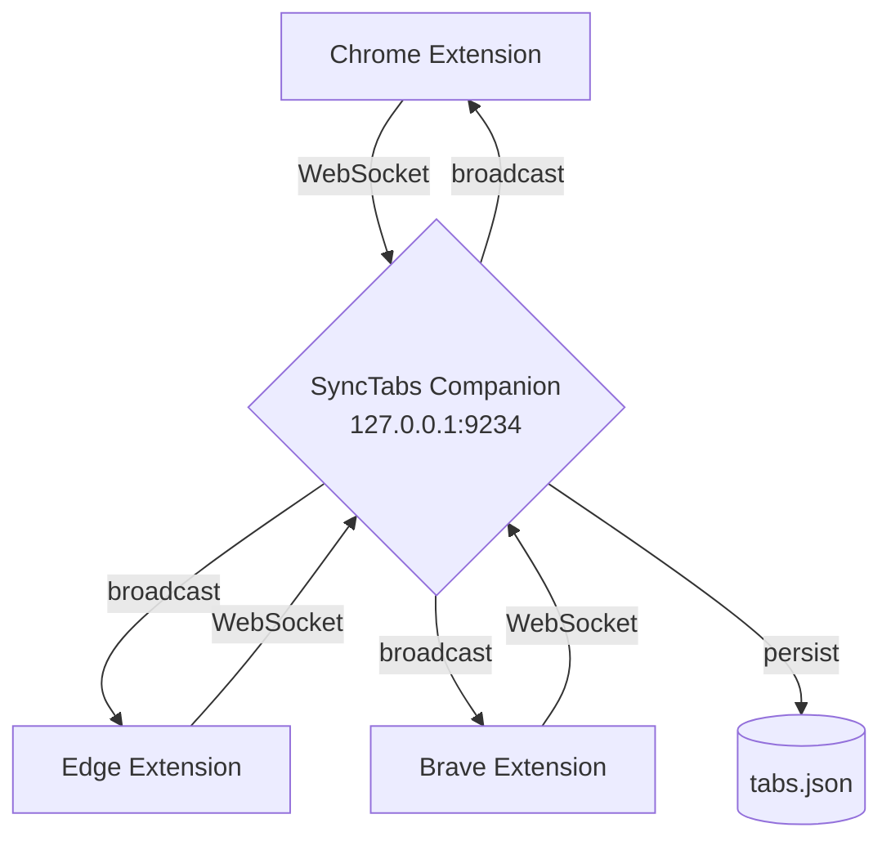
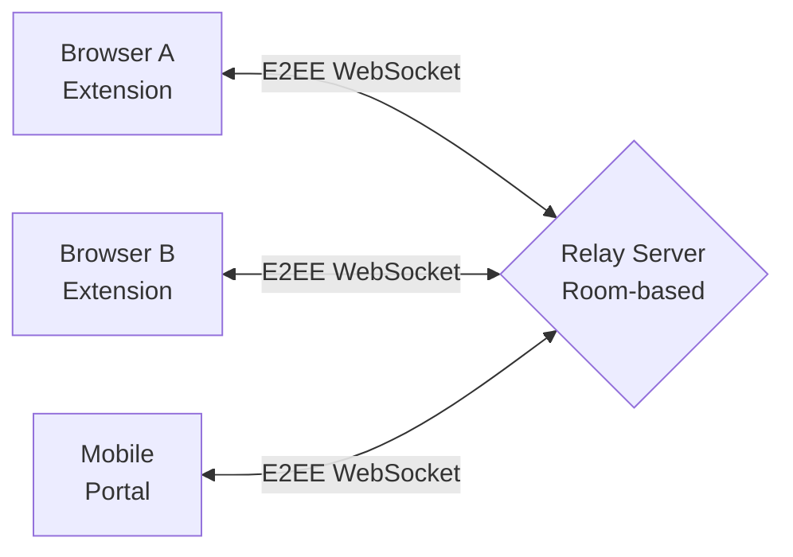

SyncTabs has three operating modes. Each adds more capability, but the extension works in local mode with zero setup.

## Local Mode (default)

No server required. The extension:

- Reads and displays your current browser tabs
- Saves tab snapshots to `chrome.storage.local`
- Tabs persist even after the browser closes
- Each browser is isolated — no cross-browser syncing

## Sync Mode (with companion)

The companion app runs a WebSocket server on `127.0.0.1` (default port `9234`). All connected browsers sync tabs in real time.

**Data flow:**

1. Each browser extension opens a persistent WebSocket connection to the companion at `ws://127.0.0.1:9234`
2. When a tab changes, the extension sends a `tabs-update` message to the companion
3. The companion broadcasts the update to all other connected browsers
4. The companion persists current tab state to `tabs.json` so offline browsers remain visible
5. When a browser reconnects, it receives the full current state plus any pending (queued) tabs

**Key properties:**

- Only `127.0.0.1` traffic — nothing leaves your machine
- The companion rejects non-loopback connections
- Companion stores: `tabs.json`, `pending-tabs.json`, `synctabs-companion.log`, `config.json`

## Relay Mode (E2E encrypted)

For cross-network sync, the extension encrypts tab data with AES-GCM 256-bit and sends it through a remote relay server. The relay is a "dumb pipe" — it never sees unencrypted data.

**Data flow:**

1. All browsers share the same secret key (exchanged via QR code or manual input)
2. Each browser encrypts tab data using AES-GCM 256-bit via the Web Crypto API
3. Encrypted data is sent to the relay server inside a room identified by the room ID
4. The relay forwards messages to all other clients in the same room
5. Receiving browsers decrypt the data with the shared secret key
6. The mobile portal can also join the room to view and send tabs from a phone

**Key properties:**

- Relay never decrypts data — it only forwards encrypted blobs
- Each message uses a random 96-bit IV (nonce)
- AES-GCM authentication tag detects tampering
- Room ID is derived from the secret key using SHA-256

## Component overview

| Component | Technology | Purpose |
|-----------|-----------|---------|
| **Extension** | JavaScript (MV3), HTML, CSS | Browser popup, background worker, settings |
| **Companion** | Go | Localhost WebSocket server, system tray, tab persistence |
| **Relay** | Node.js, `ws` | Remote E2EE relay for cross-network sync |
| **Mobile portal** | HTML, JavaScript, CSS | Web UI on the relay for phone access |
| **Safari wrapper** | Swift, Xcode | Safari Web Extension wrapper |

## Data storage

The companion stores data in platform-specific directories:

| Platform | Path |
|----------|------|
| Windows | `%APPDATA%\SyncTabs\data\` |
| macOS | `~/Library/Application Support/SyncTabs/data/` |
| Linux | `~/.local/share/SyncTabs/data/` |

Files:

- `tabs.json` — last known tabs for each browser
- `pending-tabs.json` — tabs queued for offline delivery
- `synctabs-companion.log` — application log
- `../config.json` — port, log level, data folder, auto-start settings